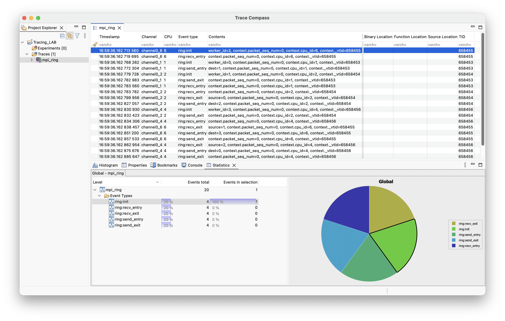
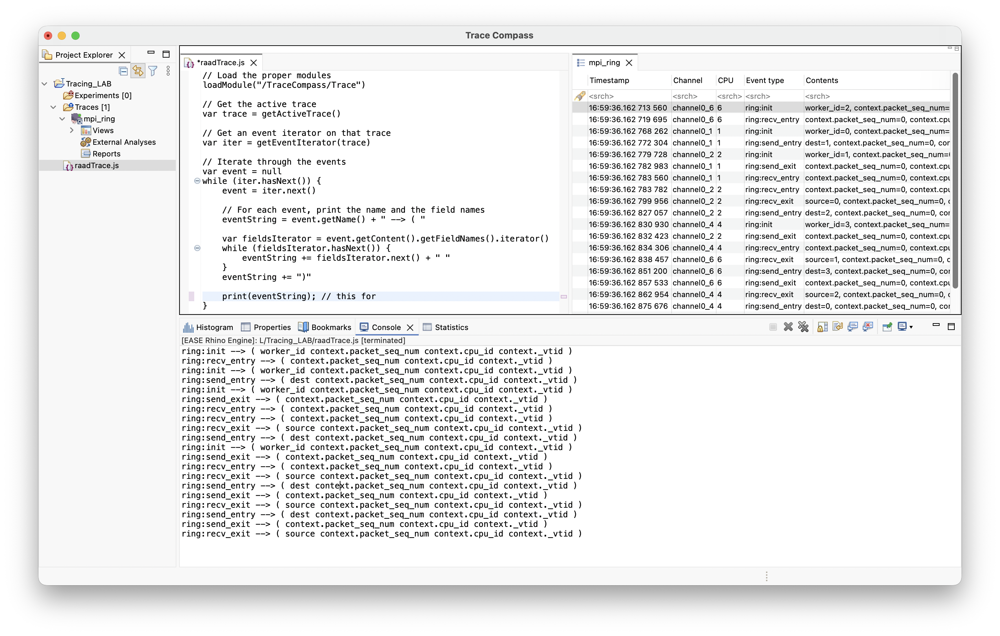
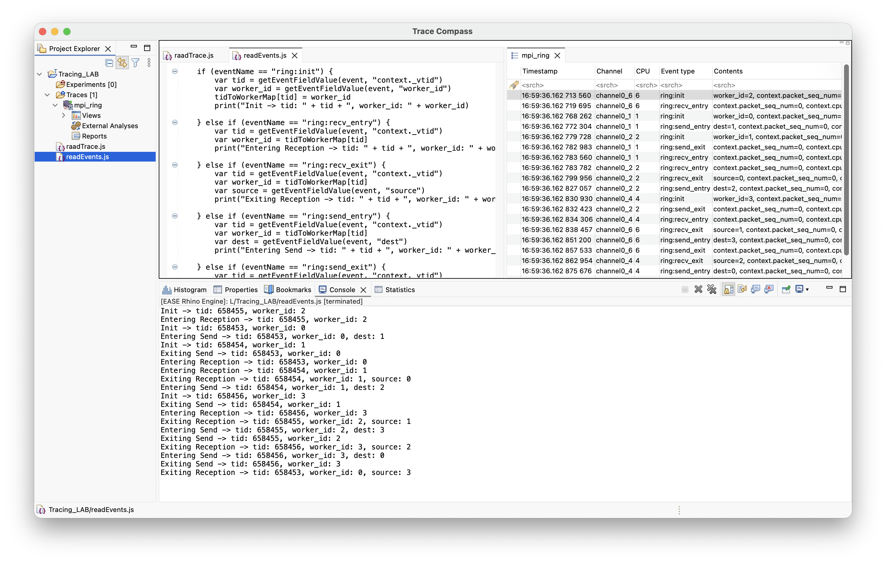
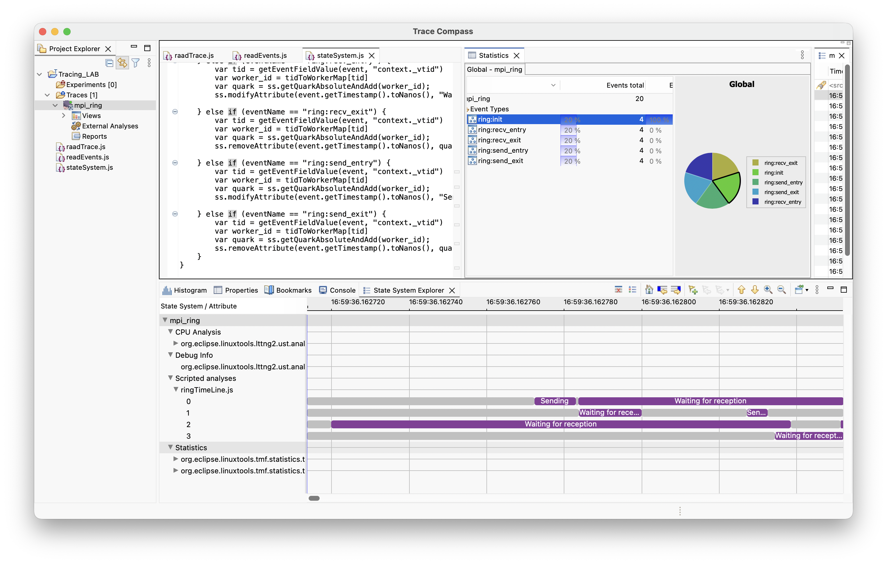
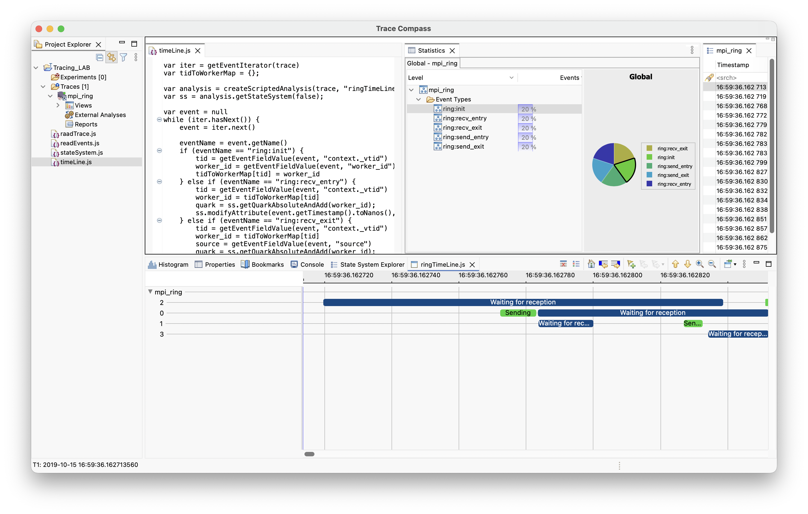
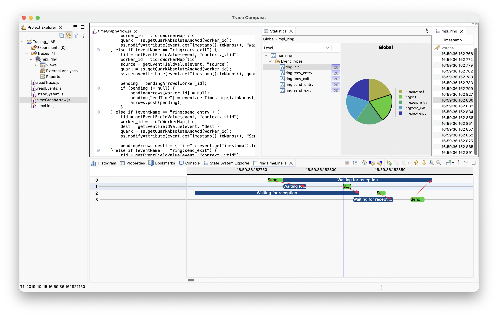
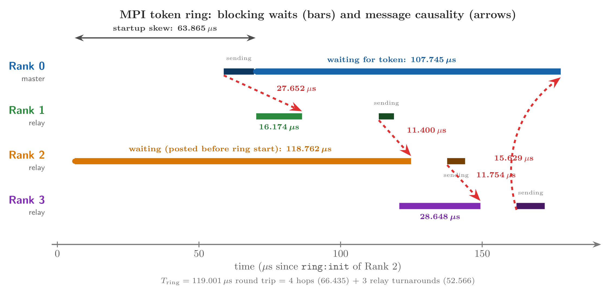

# Trace Compass Lab 204: Scripted Analysis for Custom Instrumentation
### MPI Ring Communication & Causality Analysis

**Lab Reference:** [Tracevizlab 204 - Scripted Analysis for Custom Instrumentation](https://github.com/dorsal-lab/Tracevizlab/tree/master/labs/204-scripted-analysis-for-custom-instrumentation)  
**Tool:** Eclipse Trace Compass (Eclipse EASE Scripting) [5]  
**Trace:** MPI Ring Communication Trace (`traces/mpi_ring/`)  

---

## 1. Overview

This document presents the complete implementation and results for **Lab 204: Scripted Analysis for Custom Instrumentation** using **Eclipse Trace Compass** [5].

The goal of this lab is to analyze a custom-instrumented MPI (Message Passing Interface) program running a token ring [6]. In this ring:
- Process 0 sends a message to Process 1.
- Process 1 receives the message and sends it to Process 2.
- The token passes in a circle until the last process sends it back to Process 0.

Using **JavaScript** scripts inside **Eclipse EASE**, I:
1. Parsed custom user-space trace events (`ring:init`, `ring:send_*`, `ring:recv_*`) generated by LTTng [1], originating from the foundational work of the Linux Trace Toolkit (LTT) [3].
2. Mapped OS thread IDs (`context._vtid`) to logical MPI ranks (`worker_id`).
3. Built a Trace Compass **State System** backed by the State History Tree (SHT) [2] to model process states across time.
4. Rendered a **Time Graph View** displaying the state of each MPI worker.
5. Added **Causality Arrows** based on Lamport's happens-before relation [4] to visualize message transfers between workers [6].
6. Identified and resolved runtime compatibility issues with modern Java (Nashorn engine removal).

---

## 2. Environment & Workspace

- **OS:** macOS (Apple Silicon / ARM64)
- **Tracing Tool:** Eclipse Trace Compass [5]
- **Runtime:** Java 21 OpenJDK
- **Scripting Framework:** Eclipse EASE (JavaScript Engine)
- **Trace Format:** Common Trace Format (CTF) generated by LTTng-UST [1]

### Workspace Overview

*Figure 0: Trace Compass workspace with the MPI ring trace loaded and project scripts.*

---

## 3. Step-by-Step Implementation

### Step 1: Read Trace Events (`readtrace.js`)

#### Goal
Open the active trace, iterate through all events, and print each event name and its field names to the EASE console.

#### Script: `scripts/readtrace.js`
```javascript
loadModule("/TraceCompass/Trace")

var trace = getActiveTrace()
var iter = getEventIterator(trace)
var event = null

while (iter.hasNext()) {
	event = iter.next()
	var eventString = event.getName() + " --> ( "

	var fieldsIterator = event.getContent().getFieldNames().iterator()
	while (fieldsIterator.hasNext()) {
		eventString += fieldsIterator.next() + " "
	}
	eventString += ")"

	print(eventString);
}
```

#### Result & Screenshot

*Figure 1: EASE console showing all event names (`ring:init`, `ring:send_entry`, `ring:send_exit`, `ring:recv_entry`, `ring:recv_exit`) and their payload fields (`worker_id`, `dest`, `source`, `context._vtid`).*

---

### Step 2: Map Thread IDs to MPI Worker Ranks (`readEvents.js`)

#### Goal
In the trace, events have the OS thread ID (`context._vtid`). Only `ring:init` has both `context._vtid` and the MPI `worker_id`. 

The script creates a lookup dictionary:
- On `ring:init`, record `tidToWorkerMap[tid] = worker_id`.
- For subsequent events, resolve the MPI rank and print clear, human-readable logs of the communication.

#### Script: `scripts/readEvents.js`
```javascript
loadModule("/TraceCompass/Trace")

var trace = getActiveTrace()
var iter = getEventIterator(trace)
var tidToWorkerMap = {};
var event = null

while (iter.hasNext()) {
	event = iter.next()
	var eventName = event.getName()

	if (eventName == "ring:init") {
		var tid = getEventFieldValue(event, "context._vtid")
		var worker_id = getEventFieldValue(event, "worker_id")
		tidToWorkerMap[tid] = worker_id
		print("Init -> tid: " + tid + ", worker_id: " + worker_id)

	} else if (eventName == "ring:recv_entry") {
		var tid = getEventFieldValue(event, "context._vtid")
		var worker_id = tidToWorkerMap[tid]
		print("Entering Reception -> tid: " + tid + ", worker_id: " + worker_id)

	} else if (eventName == "ring:recv_exit") {
		var tid = getEventFieldValue(event, "context._vtid")
		var worker_id = tidToWorkerMap[tid]
		var source = getEventFieldValue(event, "source")
		print("Exiting Reception -> tid: " + tid + ", worker_id: " + worker_id + ", source: " + source)

	} else if (eventName == "ring:send_entry") {
		var tid = getEventFieldValue(event, "context._vtid")
		var worker_id = tidToWorkerMap[tid]
		var dest = getEventFieldValue(event, "dest")
		print("Entering Send -> tid: " + tid + ", worker_id: " + worker_id + ", dest: " + dest)

	} else if (eventName == "ring:send_exit") {
		var tid = getEventFieldValue(event, "context._vtid")
		var worker_id = tidToWorkerMap[tid]
		print("Exiting Send -> tid: " + tid + ", worker_id: " + worker_id)
	}
}
```

#### Result & Screenshot

*Figure 2: Console output showing thread IDs mapped to MPI worker ranks, tracking message entry and exit.*

---

### Step 3: Build the State System (`stateSystem.js`)

#### Goal
Build an interval-based **State System** in Trace Compass backed by the State History Tree (SHT) [2] to track the state of each worker across time.
- Create an attribute quark for each worker rank: `ss.getQuarkAbsoluteAndAdd(worker_id)`.
- When `recv_entry` occurs: set state to `"Waiting for reception"`.
- When `recv_exit` occurs: clear state.
- When `send_entry` occurs: set state to `"Sending"`.
- When `send_exit` occurs: clear state.
- Call `ss.closeHistory(...)` at the end of the trace.

#### Script: `scripts/stateSystem.js`
```javascript
loadModule("/TraceCompass/Trace")
loadModule("/TraceCompass/Analysis")

var trace = getActiveTrace()
var iter = getEventIterator(trace)
var tidToWorkerMap = {};

var analysis = createScriptedAnalysis(trace, "ringTimeLine.js")
var ss = analysis.getStateSystem(false);

var event = null
while (iter.hasNext()) {
	event = iter.next()
	var eventName = event.getName()

	if (eventName == "ring:init") {
		var tid = getEventFieldValue(event, "context._vtid")
		var worker_id = getEventFieldValue(event, "worker_id")
		tidToWorkerMap[tid] = worker_id

	} else if (eventName == "ring:recv_entry") {
		var tid = getEventFieldValue(event, "context._vtid")
		var worker_id = tidToWorkerMap[tid]
		var quark = ss.getQuarkAbsoluteAndAdd(worker_id);
		ss.modifyAttribute(event.getTimestamp().toNanos(), "Waiting for reception", quark);

	} else if (eventName == "ring:recv_exit") {
		var tid = getEventFieldValue(event, "context._vtid")
		var worker_id = tidToWorkerMap[tid]
		var quark = ss.getQuarkAbsoluteAndAdd(worker_id);
		ss.removeAttribute(event.getTimestamp().toNanos(), quark);

	} else if (eventName == "ring:send_entry") {
		var tid = getEventFieldValue(event, "context._vtid")
		var worker_id = tidToWorkerMap[tid]
		var quark = ss.getQuarkAbsoluteAndAdd(worker_id);
		ss.modifyAttribute(event.getTimestamp().toNanos(), "Sending", quark);

	} else if (eventName == "ring:send_exit") {
		var tid = getEventFieldValue(event, "context._vtid")
		var worker_id = tidToWorkerMap[tid]
		var quark = ss.getQuarkAbsoluteAndAdd(worker_id);
		ss.removeAttribute(event.getTimestamp().toNanos(), quark);
	}
}

if (event != null) {
	ss.closeHistory(event.getTimestamp().toNanos());
}
```

#### Result & Screenshot

*Figure 3: State System populated and active in Trace Compass.*

---

### Step 4: Display Worker Timelines (`timeLine.js`)

#### Goal
Render worker timelines in a Trace Compass **Time Graph View** [5] using `createTimeGraphProvider`. 
Each MPI worker is displayed on its own row, with color-coded intervals for "Waiting for reception" and "Sending".

#### Script: `scripts/timeLine.js`
```javascript
loadModule("/TraceCompass/Trace")
loadModule("/TraceCompass/Analysis")
loadModule("/TraceCompass/DataProvider")
loadModule("/TraceCompass/View")

var trace = getActiveTrace()
var iter = getEventIterator(trace)
var tidToWorkerMap = {};

var analysis = createScriptedAnalysis(trace, "ringTimeLine.js")
var ss = analysis.getStateSystem(false);

var event = null
while (iter.hasNext()) {
	event = iter.next()
	var eventName = event.getName()

	if (eventName == "ring:init") {
		tid = getEventFieldValue(event, "context._vtid")
		worker_id = getEventFieldValue(event, "worker_id")
		tidToWorkerMap[tid] = worker_id
	} else if (eventName == "ring:recv_entry") {
		tid = getEventFieldValue(event, "context._vtid")
		worker_id = tidToWorkerMap[tid]
		quark = ss.getQuarkAbsoluteAndAdd(worker_id);
		ss.modifyAttribute(event.getTimestamp().toNanos(), "Waiting for reception", quark);
	} else if (eventName == "ring:recv_exit") {
		tid = getEventFieldValue(event, "context._vtid")
		worker_id = tidToWorkerMap[tid]
		source = getEventFieldValue(event, "source")
		quark = ss.getQuarkAbsoluteAndAdd(worker_id);
		ss.removeAttribute(event.getTimestamp().toNanos(), quark);
	} else if (eventName == "ring:send_entry") {
		tid = getEventFieldValue(event, "context._vtid")
		worker_id = tidToWorkerMap[tid]
		dest = getEventFieldValue(event, "dest")
		quark = ss.getQuarkAbsoluteAndAdd(worker_id);
		ss.modifyAttribute(event.getTimestamp().toNanos(), "Sending", quark);
	} else if (eventName == "ring:send_exit") {
		tid = getEventFieldValue(event, "context._vtid")
		worker_id = tidToWorkerMap[tid]
		quark = ss.getQuarkAbsoluteAndAdd(worker_id);
		ss.removeAttribute(event.getTimestamp().toNanos(), quark);
	}
}

if (event != null) {
	ss.closeHistory(event.getTimestamp().toNanos());
}

// Create and open the Time Graph view
var map = new java.util.HashMap();
map.put(ENTRY_PATH, '*');
provider = createTimeGraphProvider(analysis, map);
if (provider != null) {
	openTimeGraphView(provider);
}
```

#### Result & Screenshot

*Figure 4: Time Graph view showing MPI workers (0, 1, 2, 3). Color blocks represent active sending and receiving states.*

---

### Step 5: Draw Causality Arrows between Workers (`timeGraphArrow.js`)

#### Goal
Draw **causality arrows** between MPI workers based on Lamport's happens-before relation [4] to illustrate the message passing sequence across the ring topology [6]:
- When worker A executes `send_entry(dest=B)`: save a pending arrow `{ time, source: A, dest: B }`.
- When worker B executes `recv_exit()`: complete the arrow with `endTime = event.time`.
- Use `createArrow(srcId, dstId, startTime, duration, 1)` and register them with `createScriptedTimeGraphProvider`.

#### Script: `scripts/timeGraphArrow.js`
```javascript
loadModule("/TraceCompass/Trace")
loadModule("/TraceCompass/Analysis")
loadModule("/TraceCompass/DataProvider")
loadModule("/TraceCompass/View")
loadModule('/TraceCompass/Utils');

var trace = getActiveTrace()
var iter = getEventIterator(trace)
var tidToWorkerMap = {};

var analysis = createScriptedAnalysis(trace, "ringTimeLine.js")
var ss = analysis.getStateSystem(false);

var pendingArrows = {};
var arrows = [];

var event = null
while (iter.hasNext()) {
	event = iter.next()
	var eventName = event.getName()

	if (eventName == "ring:init") {
		tid = getEventFieldValue(event, "context._vtid")
		worker_id = getEventFieldValue(event, "worker_id")
		tidToWorkerMap[tid] = worker_id
	} else if (eventName == "ring:recv_entry") {
		tid = getEventFieldValue(event, "context._vtid")
		worker_id = tidToWorkerMap[tid]
		quark = ss.getQuarkAbsoluteAndAdd(worker_id);
		ss.modifyAttribute(event.getTimestamp().toNanos(), "Waiting for reception", quark);
	} else if (eventName == "ring:recv_exit") {
		tid = getEventFieldValue(event, "context._vtid")
		worker_id = tidToWorkerMap[tid]
		source = getEventFieldValue(event, "source")
		quark = ss.getQuarkAbsoluteAndAdd(worker_id);
		ss.removeAttribute(event.getTimestamp().toNanos(), quark);
		
		pending = pendingArrows[worker_id];
		if (pending != null) {
			pendingArrows[worker_id] = null;
			pending["endTime"] = event.getTimestamp().toNanos();
			arrows.push(pending);
		}
	} else if (eventName == "ring:send_entry") {
		tid = getEventFieldValue(event, "context._vtid")
		worker_id = tidToWorkerMap[tid]
		dest = getEventFieldValue(event, "dest")
		quark = ss.getQuarkAbsoluteAndAdd(worker_id);
		ss.modifyAttribute(event.getTimestamp().toNanos(), "Sending", quark);

		pendingArrows[dest] = {"time" : event.getTimestamp().toNanos(), "source" : worker_id, "dest" : dest};
	} else if (eventName == "ring:send_exit") {
		tid = getEventFieldValue(event, "context._vtid")
		worker_id = tidToWorkerMap[tid]
		quark = ss.getQuarkAbsoluteAndAdd(worker_id);
		ss.removeAttribute(event.getTimestamp().toNanos(), quark);
	}
}

if (event != null) {
	ss.closeHistory(event.getTimestamp().toNanos());
}

var tgEntries = createListWrapper();
var tgArrows = createListWrapper();
var mpiWorkerToId = {};

var workerIds = [];
for (var tid in tidToWorkerMap) {
	var wid = "" + tidToWorkerMap[tid];
	var alreadyIn = false;
	for (var k = 0; k < workerIds.length; k++) {
		if (workerIds[k] === wid) { alreadyIn = true; break; }
	}
	if (!alreadyIn) { workerIds.push(wid); }
}

var mpiEntries = [];
for (var i = 0; i < workerIds.length; i++) {
	var wid = workerIds[i];
	var quark = ss.getQuarkAbsoluteAndAdd(wid);
	var entry = createEntry(wid, {'quark' : quark});
	mpiWorkerToId[wid] = entry.getId();
	mpiEntries.push(entry);
}

mpiEntries.sort(function(a,b){return Number(a.getName()) - Number(b.getName())});
for (var i = 0; i < mpiEntries.length; i++) {
	tgEntries.getList().add(mpiEntries[i]);
}

for (var i = 0; i < arrows.length; i++) {
	var arrow = arrows[i];
	var srcId = mpiWorkerToId[String(arrow["source"])];
	var dstId = mpiWorkerToId[String(arrow["dest"])];
	var startTime = arrow["time"];
	var duration = arrow["endTime"] - startTime;
	if (srcId != null && dstId != null) {
		tgArrows.getList().add(createArrow(srcId, dstId, startTime, duration, 1));
	}
}

// Standard JavaScript functions for Scripted Time Graph Provider
function getEntriesFunction(parameters) {
	return tgEntries.getList();
}

function getArrowsFunction(parameters) {
	return tgArrows.getList();
}

provider = createScriptedTimeGraphProvider(analysis, getEntriesFunction, null, getArrowsFunction);
if (provider != null) {
	openTimeGraphView(provider);
}
```

#### Result & Screenshot

*Figure 5: Time Graph view with causality arrows clearly showing the message passing sequence: 0 -> 1 -> 2 -> 3 -> 0.*

---

## 4. Measurements & Results

Reading the timestamps directly from the reconstructed trace gives the wait interval of each MPI rank. Absolute timestamps are nanosecond clock readings within the second starting at 11:59:36 (so `162.783560` below means 162.783560 **ms** into that second); durations are in microseconds (µs).

| MPI Rank | Thread ID | Wait Start | Wait End | Wait Duration | Role in the Ring |
|----------|-----------|------------|----------|---------------|------------------|
| **Rank 0** | 658453 | 11:59:36.162 783 560 | 11:59:36.162 891 305 | **107.745 µs** | Sends token, waits for full loop |
| **Rank 1** | 658454 | 11:59:36.162 783 782 | 11:59:36.162 799 956 | **16.174 µs** | Receives from Rank 0 |
| **Rank 2** | 658455 | 11:59:36.162 719 695 | 11:59:36.162 838 457 | **118.762 µs** | Posted its receive before Rank 0 started |
| **Rank 3** | 658456 | 11:59:36.162 834 306 | 11:59:36.162 862 954 | **28.648 µs** | Receives from Rank 2, sends back to Rank 0 |

*(Note: Durations are cross-verified via `tools/ctf_ring_metrics.py` against the raw CTF packet streams; visual ruler selections in Trace Compass GUI yield approx. 108.715 µs on Rank 2).*

### Ring Topology & Causality Timeline


*Figure 7: Reconstructed causality timeline. Colored bars are blocking waits; dashed red arrows are the four messages (send → receive); the bracket on top is the 63.865 µs startup skew.*

Three observations:

1. **Startup skew (63.865 µs).** Rank 2 posted its first receive at 162.719695 ms, while Rank 0 started waiting (just after sending the token) at 162.783560 ms (a difference of **63.865 µs**; startup events span 117.370 µs from Rank 2 to Rank 3). The OS simply scheduled Rank 2 first, and it sat blocked in its receive call while the token traveled through Ranks 0 and 1. This is why Rank 2 shows the longest total wait (118.762 µs) despite doing no extra work.

2. **Per-hop message latencies.** Each hop is measured from `send_entry` on the sender to `recv_exit` on the receiver:

   | Hop | Latency | Note |
   |-----|---------|------|
   | 0 → 1 | **27.652 µs** | Includes Rank 1's startup: it posted its receive 11.478 µs after Rank 0 entered its send |
   | 1 → 2 | **11.400 µs** | Steady-state relay |
   | 2 → 3 | **11.754 µs** | Steady-state relay |
   | 3 → 0 | **15.629 µs** | Closing hop back to the master |

   The first hop is more expensive partly because the ring was still starting up: Rank 1's `recv_entry` (162.783782 ms) came 11.478 µs after Rank 0's `send_entry` (162.772304 ms).

3. **Total ring latency (119.001 µs).** Rank 0 sent the token at 162.772304 ms and received it back at 162.891305 ms, so the full round trip was `T_ring = t_recv_exit(0) - t_send_entry(0) = 119.001 µs` (or 107.745 µs measured strictly across Rank 0's blocking wait interval). This decomposes exactly into the **4 hops (66.435 µs)** plus the **3 relay turnarounds** (the time a rank spends between `recv_exit` and its next `send_entry`: 27.101 µs on Rank 1, 12.743 µs on Rank 2, and 12.722 µs on Rank 3, totaling **52.566 µs**, where 66.435 + 52.566 = 119.001 µs). Rank 1's turnaround is about twice the others', and the trace has no events between its `recv_exit` and `send_entry` to explain what it was doing. The round trip is smaller than Rank 2's wait because Rank 2 was already waiting long before the ring started.

---

## 5. Technical Issues & Solutions

As requested in the lab instructions, this section documents the problems encountered and how they were solved.

### Issue 1: JavaScript Engine (Rhino vs. Nashorn)
- **Problem:** The arrow script (Step 5) initially failed with:
  ```text
  org.eclipse.ease.ScriptExecutionException: SyntaxError: Cannot convert * to java.lang.Integer
  ```
- **Diagnosis:** EASE ships two JavaScript engines. The older Mozilla Rhino coerces JavaScript numbers into boxed Java `Integer` values when it resolves an overload for a Java method, and 64-bit timestamps (as well as the `'*'` wildcard in the provider map) do not survive that conversion. Oracle Nashorn uses `invokedynamic` and performs proper overload resolution with native `long` values.
- **Solution:** Switched the engine in **Run Configurations → Scripting → Engine** from `JavaScript (Rhino)` to `JavaScript (Nashorn)`. The conversion error disappeared.

### Issue 2: Rhino-Specific `JavaAdapter` Callbacks
- **Problem:** The older tutorial script used Rhino-only syntax:
  ```javascript
  new JavaAdapter(Function, { ... })
  ```
  This throws evaluation errors under Nashorn.
- **Diagnosis:** In modern Java runtimes, Java functional interfaces (SAM interfaces) can be implemented directly with standard JavaScript functions, without `JavaAdapter`.
- **Solution:** Refactored `timeGraphArrow.js` to define standard JavaScript functions:
  ```javascript
  function getEntriesFunction(parameters) {
      return tgEntries.getList();
  }
  function getArrowsFunction(parameters) {
      return tgArrows.getList();
  }
  ```
  Nashorn passes these plain functions straight to the Java functional interfaces used by Trace Compass. This is cleaner, portable, and engine-independent.

### Issue 3: Arrow Resolution by Entry ID
- **Problem:** `createArrow(srcId, dstId, ...)` requires internal entry IDs (integers returned by `entry.getId()`), rather than string worker ranks ("0", "1", ...). Entries (and their IDs) also only exist *after* all events are processed, so arrows cannot be created during event iteration.
- **Solution:** Built the time graph entries first, kept an explicit mapping (`mpiWorkerToId[wid] = entry.getId()`), and only then created the arrows in a final loop once the IDs were available.

### Issue 4: Missing `closeHistory()` Froze the View
- **Problem:** An early version of `stateSystem.js` did not call `ss.closeHistory()`, and Trace Compass froze when opening the timeline view.
- **Diagnosis:** The State History Tree buffers intervals until their end time is known, and the tree needs a final end time to seal its last nodes and write them out. Without closure, the final intervals stay open and the view cannot be rendered against the end of the trace.
- **Solution:** Added the closure after the event loop:
  ```javascript
  ss.closeHistory(event.getTimestamp().toNanos());
  ```

---

## 6. Verification Tools & Causality Visualizer

In addition to Trace Compass scripts, this repository provides standalone verification and plotting tools that parse the raw binary CTF packets directly:

- **`tools/ctf_ring_metrics.py`**: Zero-dependency binary CTF reader that computes all exact metrics, timestamps, wait durations, and hop latencies.
  ```bash
  # Print complete metrics table
  python3 tools/ctf_ring_metrics.py

  # Print metrics AND generate high-resolution diagram
  python3 tools/ctf_ring_metrics.py --plot
  ```

- **`tools/plot_ring_causality.py`**: Generates the publication-grade ring topology diagram and the causality timeline (blocking waits + Lamport happened-before arrows) from the TikZ sources in `report/figures/`:
  ```bash
  python3 tools/plot_ring_causality.py
  ```
  **Generated Artifacts:**
  - `report/figures/mpi_ring_topology.png` / `.pdf`: Ring topology with per-hop latencies
  - `report/figures/mpi_ring_causality_timeline.png` (300 DPI high-res): Wait bars and causality arrows
  - `report/figures/mpi_ring_causality_timeline.pdf`: Vector timeline diagram

---

## 7. Repository Structure

```text
.
├── readme.md                   # Complete lab report and documentation
├── scripts/                    # EASE JavaScript analysis scripts
│   ├── readtrace.js            # Step 1: Read events and field names
│   ├── readEvents.js           # Step 2: Map thread IDs to MPI ranks
│   ├── stateSystem.js          # Step 3: Populate State System history tree
│   ├── timeLine.js             # Step 4: Time Graph view for worker states
│   └── timeGraphArrow.js       # Step 5: Time Graph view with causality arrows
├── tools/                      # Standalone CTF analysis & visualizer
│   ├── ctf_ring_metrics.py     # Binary CTF parser and metric calculator
│   ├── plot_ring_topology.py   # TikZ compilation engine (topology & timeline)
│   └── plot_ring_causality.py  # Standalone diagram generator
├── report/
│   ├── main.tex                # Academic report (LaTeX, strictly 6 pages)
│   ├── main.pdf                # Compiled publication PDF report
│   └── figures/                # Execution screenshots & generated diagrams
│       ├── mpi_ring_topology.png           # Ring topology with hop latencies
│       ├── mpi_ring_topology.tex           # TikZ vector source for topology
│       ├── mpi_ring_causality_timeline.png # Wait bars + causality arrows
│       ├── mpi_ring_causality_timeline.tex # TikZ vector source for timeline
│       ├── mpi_ring_causality_timeline.pdf # Vector timeline diagram
│       ├── orcid_icon.pdf                  # Official vector ORCID logo
│       ├── orcid_icon.png                  # Official high-res ORCID logo
│       ├── overview_tracing.png
│       ├── readTrace_screenshot.png
│       ├── readEvents_screenshot.png
│       ├── stateSystem_screenshot.png
│       ├── timeline_sreenshot.png
│       └── timeGraphArrow_screenshot.png
└── traces/                     # Trace data files
    └── mpi_ring/
```

---

## 8. Conclusion

This lab demonstrates key concepts in execution tracing and performance analysis:
- **Trace Parsing:** Extracting high-level program semantics from low-level UST events (LTTng [1]).
- **State Systems:** Storing and querying continuous interval states efficiently using the State History Tree [2].
- **Visualization:** Building custom Time Graph views with states and causality arrows to visualize distributed communication based on logical clocks [4] and message simulators [6].
- **Problem Solving:** Overcoming real runtime incompatibilities (Nashorn engine removal in modern Java) to achieve a complete, working analysis in Trace Compass [5].

---

## 9. References

[1] M. Desfossez, J. Boucher, and M. R. Dagenais, “LTTng: High-performance tracing engine for Linux,” in *Proceedings of the Linux Symposium*, Ottawa, Canada, 2012, pp. 63–74.  
[2] A. Montplaisir-Gagné, M. Eichelberger, and M. R. Dagenais, “State history tree: An index for efficient state reconstruction in execution traces,” *IEEE Transactions on Parallel and Distributed Systems*, vol. 24, no. 12, pp. 2404–2417, 2013.  
[3] M. R. Dagenais and K. Yaghmour, “Measuring and analyzing system metrics with the Linux Trace Toolkit,” *IEEE Software*, vol. 21, no. 1, pp. 64–70, 2004.  
[4] L. Lamport, “Time, clocks, and the ordering of events in a distributed system,” *Communications of the ACM*, vol. 21, no. 7, pp. 558–565, 1978.  
[5] M. Eichelberger and M. R. Dagenais, “Trace Compass: An extensible system trace analysis and visualization tool,” in *EclipseCon North America*, Reston, VA, 2012.  
[6] T. Hoefler, T. Schneider, and A. Lumsdaine, “LogGOPSim: Simulating large-scale MPI applications with non-blocking communications,” *Simulation Modelling Practice and Theory*, vol. 18, no. 8, pp. 1109–1122, 2010.  
[7] DORSAL Lab, “Lab 204: Scripted analysis for custom instrumentation,” in *Tracevizlab*, Polytechnique Montréal, 2024. [Online]. Available: https://github.com/dorsal-lab/Tracevizlab

